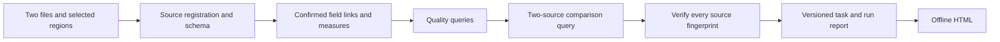

# InsightAgent

English | [中文](README.zh.md)

InsightAgent is a visual, evidence-grounded data analysis product built in this DeepSeek Harness workspace. The Web workbench configures analyses of workspace-local XLSX, CSV, SQLite, and DuckDB files. The Agent interprets verified results and recommends follow-up analysis.

## Repository map

| Path | Responsibility |
|---|---|
| `packages/client/ui-insight-workbench/` | Data picker, analysis configuration, result tables and charts |
| `packages/api/insight-controller/` | Session-scoped Web-to-MCP bridge |
| `packages/insight/insight-evidence/` | Structured diagnostic plans, bounded execution, and current-session query evidence |
| `packages/bundle/web-app/presets/insight-agent.patch.yml` | Shipped InsightAgent persona and data tools |
| `packages/bundle/web-app/insight-skills/` | Analysis workflow skills |
| `python/insight-mcp/` | Read-only data service and SQL policy |
| `evals/` | Frozen office, synthetic SQL, and BIRD evaluation cases and runner |
| `examples/insight-agent/` | Reproducible workbook and expected results |

The Web bundle declares InsightAgent as the default preset. Preset configuration is owned by the declarative DSH bundle; no separate preset install or copied configuration is required. The Python interpreter is selected through `INSIGHT_AGENT_PYTHON`.

## Build and run on Windows

Requires Node.js 22.20.0, pnpm 11.7.0, and Python 3.11. Configure a DeepSeek provider in DSH before running an Agent analysis.

```powershell
pnpm install --frozen-lockfile
pnpm run build:lib
pnpm run build:web

conda create -n insight-agent python=3.11
conda run -n insight-agent python -m pip install -e ".\python\insight-mcp[dev]"
$env:INSIGHT_AGENT_PYTHON = (conda run -n insight-agent python -c "import sys; print(sys.executable)").Trim()
$env:INSIGHT_WORKSPACE = (Get-Location).Path
$env:DSH_HOME = Join-Path (Get-Location) '.generated\dsh-home'
pnpm dsh web
```

Open the displayed local URL and create a new blank session. InsightAgent should be selected by default. To use the sample workbook, choose this repository as the workspace and import `examples/insight-agent/insight-sales-demo.xlsx`. The workbook contains `订单` and `客户` sheets; its expected analysis is documented in [the example](../../examples/insight-agent/README.md).

The selected workspace must match `INSIGHT_WORKSPACE`, which is fixed when the Web profile starts. To analyze another folder, set `INSIGHT_WORKSPACE` to that folder before launching DSH and select the same folder in the Web app. Data paths must remain inside it. The MCP interpreter needs the editable `insight-mcp` installation above. Use a fresh `DSH_HOME` for acceptance when an older profile has a saved preset override.

The Agent discovers candidate data files through bounded `list_source_files` calls. Provide a narrower directory or explicit paths when the listing is incomplete.

## Diagnose two periods

Open the right-side Insight panel and choose **Two-period diagnosis**. Upload baseline and current CSV/XLSX files, choose each worksheet and physical header/data rows, then confirm the field links. Matching names are linked automatically; confirm differently named fields explicitly. Set up to three measures, up to two dimensions, and an optional uniqueness key. The workbench shows quality findings, totals, group changes, query IDs, and a downloadable script-free HTML report. A named task stores the selections and measure definitions without storing runtime source IDs; upload replacement files and recheck links before another run.



The Agent uses `submit_diagnostic_plan` and `execute_diagnostic_plan` for a model-authored plan with field-mapping reasons and confirmed measure definitions. The planning tool permits two corrections by default; the data service computes every number. `submit_analysis` accepts only current-session verified query IDs and checks cited row/column numeric values against recorded result cells. Textual business explanations still require independent validation.

## Verification

```powershell
node --experimental-strip-types scripts/insight/check-config.ts
node_modules/.bin/vitest.cmd run packages/insight/insight-evidence/tests
conda run -n insight-agent python -m pytest python/insight-mcp/tests
```

For browser acceptance, import two files in a fresh InsightAgent session, check a quality count and a metric total, download the HTML report, save the task, and replace the current file for a second run. Each report records both file fingerprints and its own query IDs. Agent claims cite verified IDs from `execute_sql`, `execute_analysis`, `diagnose_table`, or `compare_tables` in that session.

The [evaluation guide](../../evals/README.md) owns fixture checks, the 30-case office suite, JSON trace scoring, phased model runs, and BIRD EX. Model-backed evaluation requires configured provider credentials and is outside deterministic CI.

## Source and licenses

This repository incorporates DeepSeek Harness under the root [MIT license](../../LICENSE). InsightAgent's third-party acknowledgments are in [its notices](THIRD_PARTY_NOTICES.md); the DSH notices remain at the repository root.
