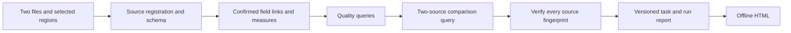

# InsightAgent

[English](README.md) | 中文

InsightAgent 是构建在本仓库 DeepSeek Harness 工作区中的可视化、证据驱动数据分析产品。Web 工作台配置工作区内 XLSX、CSV、SQLite 和 DuckDB 文件的分析；Agent 解释已校验结果并推荐后续分析。

## 仓库目录

| 路径 | 职责 |
|---|---|
| `packages/client/ui-insight-workbench/` | 文件选择、分析配置、结果表格和图表 |
| `packages/api/insight-controller/` | 会话级 Web 与 MCP 连接 |
| `packages/insight/insight-evidence/` | 结构化诊断计划、有限次修正执行和当前会话查询证据 |
| `packages/bundle/web-app/presets/insight-agent.patch.yml` | 随 Web 发布的 InsightAgent Persona 和数据工具 |
| `packages/bundle/web-app/insight-skills/` | 分析流程 Skills |
| `python/insight-mcp/` | 只读数据服务与 SQL 策略 |
| `evals/` | 冻结的办公任务、合成 SQL 和 BIRD 评测用例及运行器 |
| `examples/insight-agent/` | 可复现工作簿与预期结果 |

Web bundle 将 InsightAgent 声明为默认 Preset。Preset 配置由 DSH 声明式 bundle 管理，无需单独安装或复制配置。通过 `INSIGHT_AGENT_PYTHON` 选择 Python 解释器。

## 在 Windows 上构建和运行

需要 Node.js 22.20.0、pnpm 11.7.0 和 Python 3.11。运行 Agent 分析前，应先在 DSH 中配置 DeepSeek 模型 Provider。

```powershell
pnpm install --frozen-lockfile
pnpm run build:lib
pnpm run build:web

conda create -n insight-agent python=3.11
conda run -n insight-agent python -m pip install -e ".\python\insight-mcp[dev]"
$env:INSIGHT_AGENT_PYTHON = (conda run -n insight-agent python -c "import sys; print(sys.executable)").Trim()
$env:INSIGHT_WORKSPACE = (Get-Location).Path
$env:DSH_HOME = Join-Path (Get-Location) '.generated\dsh-home'
pnpm dsh web
```

打开显示的本地 URL，新建空白会话；默认应选中 InsightAgent。使用示例工作簿时，选择本仓库作为工作区，导入 `examples/insight-agent/insight-sales-demo.xlsx`。工作簿包含 `订单` 和 `客户` 两个工作表，预期结果见[示例说明](../../examples/insight-agent/README.zh.md)。

所选工作区必须与 `INSIGHT_WORKSPACE` 一致；Web Profile 启动时会固定此目录。分析其他文件夹时，先将 `INSIGHT_WORKSPACE` 设为该目录，再启动 DSH 并在 Web 界面选择同一目录。数据路径必须位于该目录内。MCP 所用解释器需要按上方命令安装可编辑的 `insight-mcp` 包。若旧 Profile 保存了其他 Preset 选择，验收时请使用新的 `DSH_HOME`。

Agent 通过有遍历上限的 `list_source_files` 查找候选文件；若结果不完整，请提供更窄的目录或明确路径。

## 双期诊断复盘

打开右侧 Insight 面板，选择“双期诊断复盘”。上传上期和本期 CSV/XLSX 文件，分别选择工作表及物理表头行、数据行，再确认字段对应。同名字段自动对应；异名字段需要明确确认。配置最多三个指标、两个维度和可选唯一键。工作台展示质量发现、总体指标、分组变化和查询 ID，并下载不含脚本的离线 HTML 报告。具名任务只保存区域与指标配置，不保存运行时数据源 ID；替换文件后需重新检查字段再运行。



Agent 使用 `submit_diagnostic_plan` 和 `execute_diagnostic_plan` 提交带字段映射依据及已确认指标定义的结构化计划。规划工具默认允许两次修正，数据服务计算所有数值。`submit_analysis` 只接受当前会话已校验的查询 ID，并逐项核对引用的行列数值；文字中的业务原因仍需另外验证。

## 验证

```powershell
node --experimental-strip-types scripts/insight/check-config.ts
node_modules/.bin/vitest.cmd run packages/insight/insight-evidence/tests
conda run -n insight-agent python -m pytest python/insight-mcp/tests
```

浏览器验收时，在新的 InsightAgent 会话导入两份文件，核对一项质量数量和一个总体指标，下载 HTML 报告，保存任务并替换本期文件后再运行。每份报告记录两份文件的指纹及本次查询 ID。Agent 结论引用同一会话中由 `execute_sql`、`execute_analysis`、`diagnose_table` 或 `compare_tables` 产生并校验的 ID。

[评测指南](../../evals/README.zh.md)说明数据检查、30 个办公任务、JSON 轨迹评分、分阶段模型运行和 BIRD EX。调用真实模型的评测需要 Provider 凭据，不属于确定性 CI。

## 来源与许可

本仓库整合的 DeepSeek Harness 遵循根目录的 [MIT 许可证](../../LICENSE)。InsightAgent 的第三方致谢见[项目说明](THIRD_PARTY_NOTICES.zh.md)；DSH 的致谢仍在仓库根目录。
